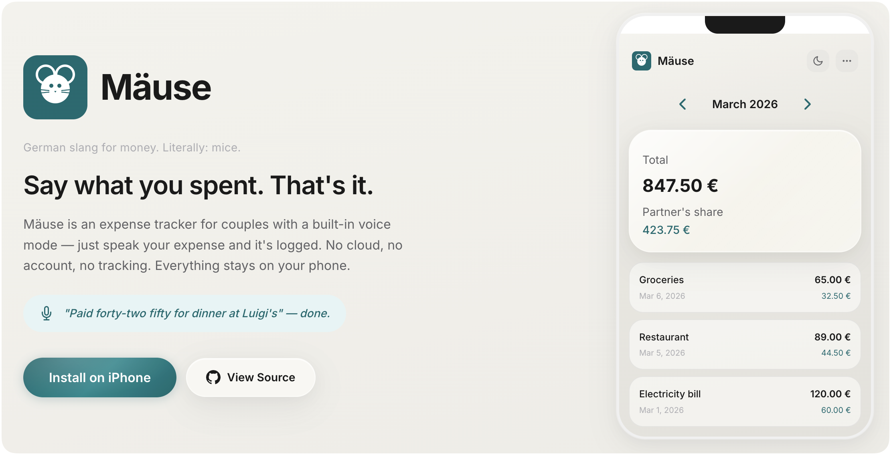

# Mäuse 🐭

Mäuse is a local-first expense tracker for couples. It keeps shared expenses lightweight: open the app, add an amount, choose how to split it, and move on.

  

## Highlights

- Fast manual entry with percentage or fixed partner split
- Separate voice entry mode with record-then-process review for amount, description, date, and partner share
- Monthly overview with combined totals
- Local IndexedDB storage with JSON backup and restore
- Installable PWA that works well on iPhone home screens
- Manual mode works offline; voice mode is online-only

## Voice Mode

Voice mode is disabled by default and must be enabled in Settings.

1. Open `Settings`
2. Paste an OpenAI API key
3. Tap `Verify Key`
4. Turn on `Enable voice mode`
5. Use the mic button next to the `+` button

What voice mode does:

- Opens a single voice sheet with a mic button
- Tap the mic to start recording, speak one expense, then tap again to stop
- The mic button animates inline while AI transcribes, cleans, and extracts the expense
- Shows the result as familiar form fields (amount, description, date, split) matching the manual entry layout
- Tap `Done` to save, or use `Redo` / `Edit manually` to adjust
- Saves exactly the reviewed draft you saw on screen
- Requires an internet connection and microphone access

Voice implementation details:

- Audio transcription uses OpenAI `gpt-4o-transcribe`
- Transcript cleanup uses OpenAI `gpt-5.4`
- Structured field extraction uses OpenAI `gpt-5.4`
- The cleaned transcript is the only semantic source of truth for extraction
- Saving never changes fields behind the scenes; the saved expense always matches the reviewed draft you saw
- Optional local debug logging can be enabled with `?voiceDebug=1` on desktop browsers; inspect `window.MaeuseVoiceDebug.getLogs()` or call `window.MaeuseVoiceDebug.download()` in DevTools
- Desktop voice debug logs include recording metadata, raw transcription responses, cleanup payloads/responses, extraction payloads/responses, and parsed drafts

Privacy and storage:

- The OpenAI API key is stored locally on the device
- The API key and voice-mode setting are excluded from backup exports
- Voice mode records locally first, then sends the audio plus hidden transcription data to OpenAI after you stop recording
- Manual expense data stays in the app's local storage unless you export it

## Manual Entry

Manual entry is always available from the `+` button.

- Enter amount, description, and date
- Choose a percentage split or a fixed amount for your partner
- Save directly into the current month

## Backup And Restore

The app can export expenses to JSON and import them back on another device.

- Export creates a portable backup of expense data
- Import replaces the current local expense data after confirmation
- Voice secrets are intentionally not included in the backup

## Install On iPhone

1. Open the app URL in Safari
2. Tap the Share button
3. Select `Add to Home Screen`
4. Launch Mäuse from the home screen like a native app

## Development

There is no build step.

1. Clone the repo
2. Serve the folder with any static file server, or open `index.html` directly
3. Make changes in `index.html`, `style.css`, `app.js`, and `voice-utils.js`

Useful checks:

- `node --test`
- `node --check app.js`
- `node --check voice-utils.js`
- `node --check sw.js`

## Tech

- Vanilla HTML, CSS, and JavaScript
- IndexedDB for local persistence
- Service Worker for offline caching
- Progressive Web App manifest
- OpenAI Audio Transcriptions + Responses APIs for voice mode
